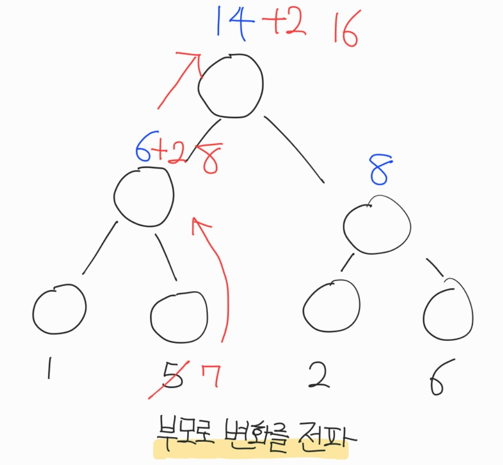
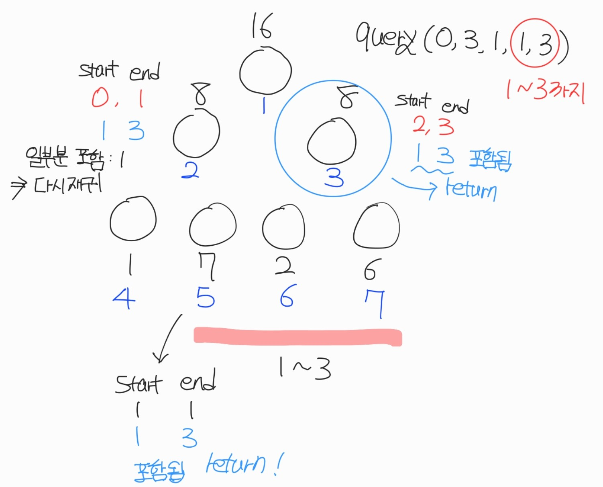

# 세그먼트트리

## 개요

세그먼트 트리는 구간에 변동이 자주 일어나는 환경에서 구간 별 결과를 빠르게 출력해야할 때 사용한다.
값이 변동되면 이 변동되는 것이 Root까지 전파되며, 이진 트리 형태를 구성하기 떄문에
업데이트에 걸리는 시간은 log(N)이고, 원하는 구간 별 값을 찾아 오는데도 걸리는 시간은 log(N)이다.
 
이를 통해 구간에 잦은 변동을 log(N)에 해결할 수 있지만,
모든 구간에 대한 변화를 트리에 넣어야하기 때문에 메모리를 많이 차지한다.

대략적으로 배열이 N이면, 트리는 4*N으로 잡는다. 정밀하게 잡으면 더 작지만, 단순 계산으로 4배 더 잡는다.

구간 별 다양한 연산을 수행할 수 있으며, 덧셈, 곱셈, 나눗셈, 나머지 등등 모든 구간에 적용할 연산을 다르게 사용할 수 있다.

## 방법

1. 세그먼트 트리는 start, end, node로 구성되어 있고, 원하는 index에 v 연산을 진행할 수 있다.
2. 여기서 start는 0, end는 N-1로 보통 시작되며 node는 0이 아닌 값을 넣어야한다. <b>node에 *2, *2 +1 연산을 하기 때문이다.</b>
3. start와 end가 같으면 그때가 자신이 찾는 node, leaf 노드가 된다.
4. leaf노드 값이 변화하면 이를 parent Node에 전파하고, root까지 전파를 수행한다.
5. Query를 날려서 원하는 값을 찾아올 수 있다.


## 요약

### 업데이트 과정 
 

### 쿼리 과정
 

## 예제 코드

```cpp
#include <iostream>

using namespace std;
#define MAX 100

int arr[MAX];
int tree[MAX*4]; // tree의 크기를 계산하는 법은 보통, log를 취해 높이를 계산한 후 크기를 따지지만, 어림잡아 *4를 하면 최적화는 아니더라도 메모리 오류는 나지 않는다. 
int query(int start, int end, int node, int left, int right){
	//left, right : 원하는 구간의 범위
	//start , end : 실제 범위로 잡은 구간 크기
	if(left > end || right < start) return 0; // -> 구간에 일치하는 부분이 하나도 없는 경우 당연하게 0을 반환한다.
	if(left <= start && end<=right) return tree[node]; // -> 원하는 구간이 실제 범위로 잡은 구간보다 큰 경우 모든 값의 합을 반환한다.
	int mid = (start + end) / 2;
	return query(start, mid, node*2, left, right) + query(mid+1, end, node*2+1, left, right); //재귀로 구간을 탐색하면서 결과를 찾는다.
}

void update_tree(int start, int end, int node, int index, int diff){
	if(index < start || index > end) return; // index가 구간에 없는 경우 더 이상 계산할 필요가 없기 때문에 끝낸다.
	tree[node] += diff; //구간에 있는 경우 변동사항을 적용해야한다. //변동사항은 다양하게 사용할 수 있다.
	if(start == end) return; //결과를 찾았으니 반복할 필요 없이 끝낸다.
	int mid = (start + end) / 2;
	update_tree(start, mid, node*2, index, diff); //재귀를 통해 왼쪽, 오른쪽을 가면서 목적지 트리를 찾아나간다.
	update_tree(mid+1, end, node*2+1, index, diff);
}


int main(){
	for(int i=0;i<=9;i++) {
        arr[i] = i;
        update_tree(0,9,1,i,arr[i]); //arr[i]의 값을 i번째 위치에 업데이트한다.
    }

	cout << query(0,9,1,2,5); //2번째에서 5번쨰까지 출력하기 값: 10 ||||| 왜? 첫번째: 0 두번째: 1 로 시작하기 떄문.. 1,2,3,4 => 10
	update_tree(0,9,1,2,10);  // 2번째의 값에 10만큼 추가 => 즉, 0, 11, 2, 3 , 4 ..
	return 0;
}
```