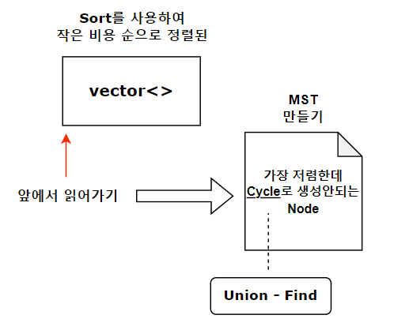

# 크루스칼

## 개요

 MST를 만들어야할 때 사용하는 알고리즘이다. MST는 모든 노드를 최소한의 비용으로 연결하는 걸 의미한다.
 
 1. 서로소 집합(Union-Find)의 시간은 통상적으로 O(1) **완벽한 1**은 아님 으로 계산된다.
 2. 간선을 정렬하는데 시간이 Elog(E)가 걸리며, 순회하는데 E가 소모되기 때문에
 3. 전체적인 시간은 Elog(E)가 걸린다.
 *간선수가 적다면 크루스칼, 간선수가 V보다 많다면 프림이 더 좋을 수 있다.

## 방법

1. 모든 간선을 비용이 낮은 순서대로 정렬한다.
2. 비용이 낮은 순서대로 간선을 선택하되, Node와 Node를 연결하기 전 이 둘간 Cycle이 형성되는지 확인한다.
3. Cycle은 Union-Find를 통해 확인하며, 이미 연결되어 있는지 아닌지을 알 수 있다.
4. 모든 탐색이 끝나면 종료한다.
* **양방향 그래프**에서 작동한다.


## 요약
 

## 예제 코드


```cpp
#include <iostream>
#include <vector>
#include <algorithm>
#include <queue>
#define MAX 500

using namespace std;

bool cmp(pair<int,pair<int,int>> &p1,pair<int,pair<int,int>> &p2){
  return p1.first < p2.first; //오름차순정렬
}

int node[MAX];
int GetParent(int x){
  if(x==node[x]) return x;
  else return node[x] = GetParent(node[x]);
}
void UnionParent(int a, int b){
  a = GetParent(a);
  b = GetParent(b);
  if(a<b) node[b] = a;
  else node[a] = b; 
}
bool FindParent(int a, int b){
  a = GetParent(a);
  b = GetParent(b);
  if(a==b) return true;
  else return false;
}
int main(){
  for(int i=0;i<MAX;i++)
    node[i] = i;

  vector<pair<int,pair<int,int>>> graph;
  //first => cost. second.first = from. second.second = to;
  sort(graph.begin(),graph.end(),cmp);
  int costs = 0;
  for(int i=0;i<graph.size();i++){
    if(!FindParent(graph[i].second.first,graph[i].second.second)){
      //둘 사이에 사이클이 형성되어있지 않은 경우.
      costs += graph[i].first; //비용을 더해준다. (선택했다는 뜻)
      UnionParent(graph[i].second.first,graph[i].second.second);
      //둘 사이를 연결해준다. (방문했다고도 봐도 되겠다. ~~ 같은 집합이다.)
    }
  }

  return 0;
}
```

## 활용

1. 양방향 그래프에서 MST를 찾아야하는 경우(비용을 출력해야하는 경우)
2. 출발지점이 정해져 있는 MST