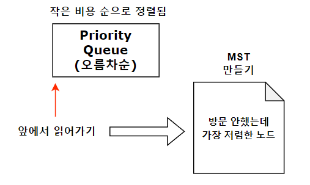

# 프림

## 개요

 MST를 만들어야할 때 사용하는 알고리즘이다. MST는 모든 노드를 최소한의 비용으로 연결하는 걸 의미한다.
 
1. 프림 알고리즘은 모든 노드에 대해 탐색을 진행하므로 V번에, 매 번 탐색할 때마다 우선 순위 큐로 다음 노드를 찾기 때문에
   Vlog(V)의 시간이 걸리고, 인접 간선을 탐색하는 시간 O(E)에, 각 간선을 우선 순위 큐에 넣는 시간 log E가 걸려 ElogE가 또 걸린다.
   즉 O(Vlog(V) + Elog(V)) 가 되는데, 보통 간선이 노드보다 더 많기 때문에 Elog(V)로 축약한다.
2. 최소 경로는 PQ에 넣어져 언제나 가장 낮은 비용의 경로를 먼저 확인한다.
3. PQ는 오름차순으로 정렬되어야하니 **greater**을 사용하고, pair<int,int>는 first를 기준으로 정렬되니 **pair<int,int>의 first**를 비용으로 사용한다.    

## 방법

0. 시작 지점을 선택해 비용을 0으로 하여 우선순위 큐에 넣는다. <U>어느 시작지점도 MST 특성으로 상관없음.</U>
1. 프림알고리즘은 최초 출발 노드와 연결되어 있는 간선중 가장 가중치가 낮은걸 선택한다.
2. 출발노드 집합에 연결된 간선 중 가중치가 최소인 것을 선택하되 방문하지 않은걸 추가한다.
3. N-1개 간선이 선택될 때 까지 반복한다.
* **양방향 그래프**에서 작동한다.
* 특정 정점에서 시작해야하는게 필요할 경우 프림을 사용하는 것이 좋다.

## 요약
 

## 예제 코드


```cpp
#include <iostream>
#include <vector>
#include <algorithm>
#include <queue>
#define MAX 1001
using namespace std;
vector<pair<int,int>> graph[MAX];
int visited[MAX];
int costs = 0;
void Prim(int start){
  priority_queue<pair<int,int>,vector<pair<int,int>>,greater<pair<int,int>>> q;
  q.push({0,start});
  while(!q.empty()){
    int cost = q.top().first;
    int target = q.top().second;
    q.pop();
    if(!visited[target]){
      visited[target] = true;
      costs += cost;
      for(auto i : graph[target]){
        if(!visited[i.first])
          q.push({i.second,i.first});
      }
    }
  }
}

int main(){
  int n,m;
  cin >> n >> m;
  for(int i=0;i<m;i++){
    int from, to, cost;
    cin >> from >> to >> cost;
    graph[from].push_back({to,cost});
  }
  Prim(1);
  cout << costs;
  return 0;
}
```

## 활용

1. 양방향 그래프에서 MST를 찾아야하는 경우(비용을 출력해야하는 경우)
2. 출발지점이 정해져 있는 MST