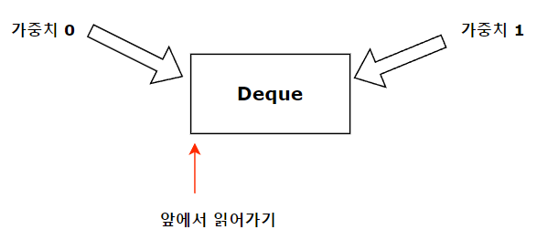

# 0-1 BFS

## 개요


**특별한 상황**에서 개선된 최소비용 탐색 알고리즘이다.

1. 일반적인 최소비용 알고리즘 "다익스트라"는 [ E log V ] 만큼 소요된다.
  => 우선순위 큐 알고리즘에 따라 log v 가 추가되기 때문이다.
2. <U>모든 간선에서 가중치가 0과 1만 존재하는 경우</U> 사용할 수 있다.
3. Deque 알고리즘을 사용하여 [ E + V ] 시간 복잡도로 해결할 수 있다.      

## 방법


1. 최소비용을 탐색하는 경우 -> 언제나 낮은 비용 순으로 탐색하게 된다.
2. 0과 1만 가중치로 가지게 될 경우
3. <U>0은 앞에서 삽입하고 1은 뒤로 삽입하여 높은 가중치는 언제나 뒤로 보낼 수 있다.</U>
4. 이를 통해 언제나 낮은 가중치를 먼저 탐색할 수 있고, 우선순위 큐를 사용하지 않아 빠르다.

## 요약
 

## 예제 코드


```cpp
#include <iostream>
#include <vector>
#include <algorithm>
#include <deque>
#define INF 2100000000
using namespace std;

void BFS01(int start, vector<vector<pair<int,int>>> &graph, vector<int> &node){
    deque<pair<int,int>> deq;
    node[start] = 0;
    deq.push_front({0,start});
    while(!deq.empty()){
        int cost = deq.front().first;
        int idx = deq.front().second;
        deq.pop_front();
        if(node[idx] > cost){
            for(auto it : graph[idx]){
                int nextcost = cost + it.second;
                if(node[it.first] > nextcost){
                    node[it.first] = nextcost;
                    if(nextcost == cost)
                        deq.push_front({nextcost,it.first});
                    else
                        deq.push_back({nextcost,it.first});
                }
            }
        }
    }
    
}
int main(){
    int n,m;
    cin >> n >> m;
    vector<vector<pair<int,int>>> graph;
    vector<int> node(n,INF);
    // cost값이 전부 0이거나 1이여야만 한다.
    for(int i=0;i<m;i++){
        int from, to, cost;
        cin >> from >> to >> cost;
        graph[from].push_back({to,cost});
        graph[to].push_back({from,cost});
    }
    BFS01(0,graph,node);
    return 0;
}
```

## 활용

1. 그래프에서 최소비용을 탐색해야하는 경우.
2. **가중치가 전부 0과 1로 이루어져 있는 경우.**
3. 일반적인 최소비용 탐색 시간 보다 빠르게 탐색이 필요한 경우.