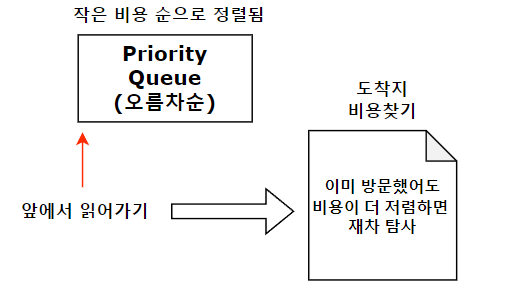

# 다익스트라

## 개요

 일반적으로 사용하는 최소비용 탐색 알고리즘이다.
 
1. 최소비용 알고리즘 "다익스트라"는 [ E log V ] 만큼 소요된다.
  => 우선순위 큐 알고리즘에 따라 log v 가 추가되기 때문이다.
2. 최소 경로는 PQ에 넣어져 언제나 가장 낮은 비용의 경로를 먼저 확인한다.
3. PQ는 오름차순으로 정렬되어야하니 **greater**을 사용하고, pair<int,int>는 first를 기준으로 정렬되니 **pair<int,int>의 first**를 비용으로 사용한다.
    

## 방법

0. 시작 지점을 선택해 비용을 0으로 하여 우선순위 큐에 넣는다.
1. 현재 노드에서 연결된 모든 노드를 확인하고, 최소 경로를 찾아 PQ에 넣는다.
2. 이후 방문하지 않은 노드를 확인해 기존 비용보다 저럼한 경로를 확인해 갱신한다.

## 요약
 

## 예제 코드


```cpp
#include <iostream>
#include <vector>
#include <algorithm>
#include <queue>
#define INF 2100000000
using namespace std;

void dijk(int start, vector<vector<pair<int,int>>> &graph, vector<int> &node){
    priority_queue<pair<int,int>,vector<pair<int,int>>, greater<pair<int,int>>> q;
    q.push({0,start});
    node[start] = 0; //출발지점의 비용은 0이다.
    while(!q.empty()){
        int cost = q.top().first;
        int target = q.top().second;
        q.pop();
        if(node[target]<cost) continue; //현재 탐사하고 있는 비용이 기존 비용보다 많으면 탐사할 필요가 없다.
        for(auto it : graph[target]){
            int nextcost = it.second + cost; //현재 노드까지 탐사 비용과 다음 노드로 향하는 비용을 덧셈한다.
            if(nextcost<node[it.first]) //현재 탐사 비용이 기존 비용보다 더 저렴하다면 탐사한다.
            {
               node[it.first] = nextcost;
               q.push({nextcost,it.first}); 
            }
        } 
    }
}
int main(){
    int n,m;
    cin >> n >> m;
    vector<vector<pair<int,int>>> graph;
    vector<int> node(n,INF);
    for(int i=0;i<m;i++){
        int from, to, cost;
        cin >> from >> to >> cost;
        graph[from].push_back({to,cost});
        graph[to].push_back({from,cost});
    }
    dijk(0,graph,node);
    return 0;
}
```

## 활용

1. 그래프에서 최소비용을 탐색해야하는 경우.
2. 출발지에서 가장 적게 비용이 드는 도착지를 찾는 경우
3. 가중치에 음수가 없는 경우