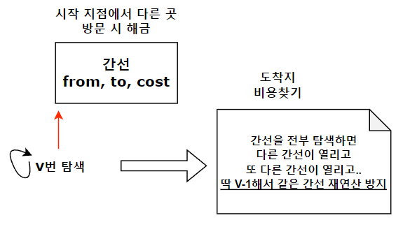

# 벨만포드

## 개요

 일반적인 최소 비용 알고리즘보다 시간 손실이 있지만, **음수**가중치에서도 동작한다.
 
 다익스트라의 경우 음수 가중치가 존재하면, 여러번 방문해도 최단 거리가 계속 줄어들어 무한 루프로 빠진다.
 
1. 벨만포드 알고리즘은 O(VE)의 시간복잡도가 소요되며, 모든 간선 E에 대해 V번 확인하기 때문이다.
2. 사실 V-1번 확인하면 최단 거리를 구할 수 있지만, 마지막에 1번 더 수행하므로 음수 싸이클을 확인할 수 있다.
3. 음수 싸이클이 존재하면, 모든 정점을 방문했어도 다시 싸이클을 돌아가는게 비용상 이득이기에
4. 마지막에 수행한 값이 더 작다면, 음수 싸이클의 존재를 확인할 수 있다.


## 방법

0. 시작 정점을 0으로 나머지 정점을 무한대로( INT의 경우 max값 ) 설정하고, 모든 간선에 대해 더 저렴할 수 있는 방법을 확인한다.
1. 더 저렴할 수 있는 방법은 node[from] + cost > node[to] => 시작에서 출발한게 더 저렴할 경우 갱신한다.
2. node[from] 시작지점이 무한대가 아니면, 이제 방문할 수 있다는 것이니 확인한다.
3. v-1 번 확인하면 출발지에 대해 모든 정점을 확인할 수 있다.
4. 1번 더 실행해서 값이 변화한다면 (줄어 든다면) 음수 사이클이 존재한다.

## 요약
 

## 예제 코드


```cpp
#include <iostream>
#include <vector>
#include <algorithm>
#include <queue>
#define INF 2100000000
#define MAX 10001
using namespace std;

struct codes
{
  int from,to,cost;
};

int n,m;
long long node[MAX];
vector<codes> city;

bool bellmanford(int start){
  node[start] = 0;
  for(int i=1;i<=n;i++){
    for(int j=0;j<city.size();j++){
      int from = city[j].from;
      int to = city[j].to;
      int cost = city[j].cost;
      
      if(node[from]==INF) continue;

      if(node[to] > node[from]+cost){
        node[to] = node[from] + cost;
        if(i==n) return true;
      }
    }
  }
  return false;
}

int main(){
  ios_base::sync_with_stdio(0);
  cin.tie(0);
  cin >> n >> m;
  for(int i=1;i<=n;i++) node[i] = INF;
  for(int i=0;i<m;i++){
    int from, to, cost;
    cin >> from >> to >> cost;
    city.push_back({from,to,cost});
  }
  if(bellmanford(1)){ //시작지점 1번을 선택하였음.
    cout << -1;
  }
  else{
    for(int i=2;i<=n;i++)
      if(node[i]==INF)
        cout << -1 << '\n';
      else
        cout << node[i] <<'\n';
  }
  return 0;
}
```

## 활용

1. 최소비용을 탐색해야하는 경우
2. 음수 가중치가 존재하는 경우
3. 음수 사이클을 판정해야하는 경우
* 시간 손실이 존재하지만 음수 조건을 돌파가능.