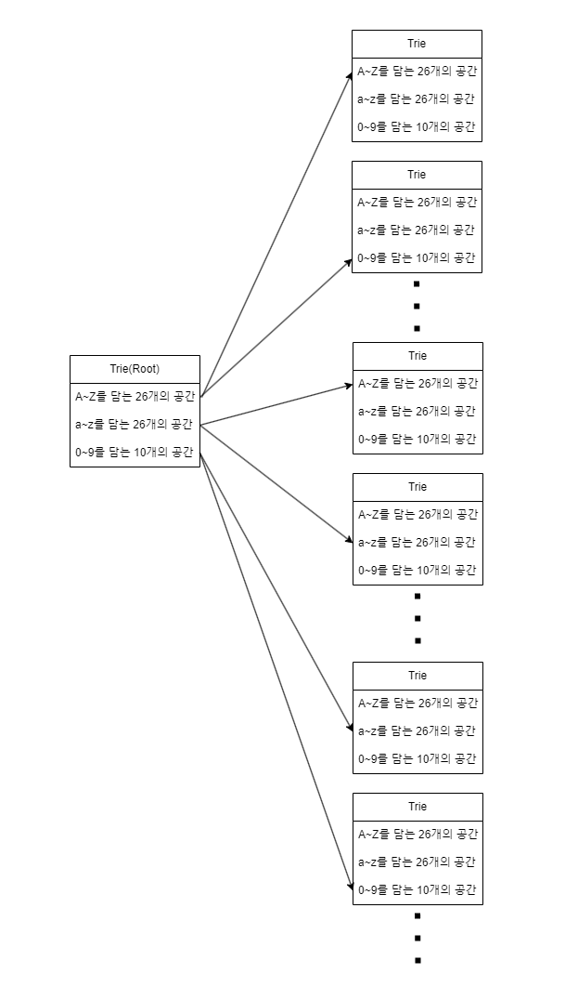

# 트라이

## 개요

 여러개의 문자열을 탐색하기 위해선 시간이 많이 소묘되며, 특히 삭제와 삽입이 빈번한 경우 더 많은 시간이 걸린다.
 힙을 이용한 정렬 및 배열을 정렬하여 문자열을 빠르게 탐색할 수 있지만, 이 경우에도 N에 영향받게 되어 많은 시간이 걸린다.

### 비교

1. 힙을 사용한 정렬(set, map): 탐색, 삽입, 삭제에 log(N)이 걸린다.
2. vector을 사용한 정렬: sort(vector) : 탐색에 O(1), 삽입에 O(1), 정렬에 NlogN이 걸린다.
3. lowerbound를 사용한 정렬: 탐색에 log N, 삽입에 N, 삭제에 N이 걸린다.
4. **Trie를 사용하여 삽입, 삭제, 탐색에 글자 길이(M) 이 걸리게 한다.**
    
    Trie를 사용하는 경우, 메모리 관리를 잘해야한다, 아스키 코드의 경우 128의 크기를 가지기 때문에, 무작정 배열을 생성하면 **128^M의 범위**를 가지게 된다. <br/>즉, 필요없는 메모리는 해제하고 필요한 문자열의 메모리만 생성하면서 메모리 관리를 하도록 한다. 
     

## 방법

1. Trie 구조체를 선언한다.
2. Trie 구조체는 데이터에 해당하는 값을 담을 수 있다.
3. 문자열을 입력 받으면, 해당하는 트라이의 깊이를 늘려가며 문자열을 전부 담는다.
4. 문자열을 탐색하는 경우, root에서 부터 탐색해가며 있는지 확인한다.
5. 문자열을 삭제하는 경우, 말단에서부터 삭제하는데, 각 트라이의 size가 0이되면 트라이 메모리를 해제한다.

*일반적으로 코테의 트라이는 알파벳을 기준으로 구성된다. 대문자 26개, 소문자 26개, 숫자 10개 총 66개를 활용한다. 다만, 아스키의 특수문자까지 활용할 수 있으니 속편하게 아스키 코드 기준 128개의 배열을 활용하는게 편하다.

## 요약
 

## 예제 코드(배열)


```cpp
#include <iostream>

struct Trie {
	Trie* next[26] = {}; //Trie의 다음 확장을 위함. 현재 대문자 26개만 관리.
	bool is_end = false;

    ~Trie(){ //트라이의 소멸자를 통한 메모리 관리.
        for(int i=0;i<26;i++)
            delete next[i];
    }

	void insert(const string& s) { //트라이의 삽입
		Trie* node = this;
		for (char it : s) {
			if (!node->next[it - 'a']) node->next[it - 'a'] = new Trie();
			node = node->next[it - 'a'];
		}
		node->is_end = true; //문자열의 마지막을 알림.
	}
	 bool search(const string& s) {
        Trie* node = this;
        for (char c : s) {
            if (!node->next[c - 'a']) return false;
            node = node->next[c - 'a'];
        }
        return node->is_end;
    }
};

int main() {
    Trie* root = new Trie();
    root->insert("apple");
    cout << root->search("apple") << endl;
    cout << root->search("app") << endl;
    delete root;  // 이 한줄로 소멸자가 연쇄 삭제되어, 모든 트라이를 삭제함.
    return 0;
}
```

## 활용

1. 삽입, 삭제가 빈번하게 활용되는 문자열을 관리하고 싶은 경우
2. 삽입하는 문자열을 정렬해야하는 경우
3. 사용자가 Trie를 수정하여 중복 여부 및 갯수, 매칭, 검색을 활용할 수 있음.
4. **이 모든 시간이 문자열의 길이 M만큼 소요됨.**
