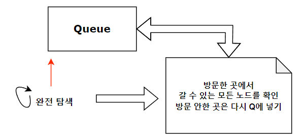

# BFS

## 개요

 트리를 완전 탐색하는 방법이다. 너비 우선으로, 큐를 사용하며 넓게 탐색하는 방법이다.
 여기서 넓게 탐색하는 것은=> 자신의 자식을 우선하지 않고 형제를 먼저 탐색하기 때문이다.
 
## 방법

1. node에서 방문할 수 있는 다음 node를 모두 graph에 기록한다.
2. queue를 생성하여 시작 node를 넣고 방문처리한다.
3. 시작 node가 갈 수 있는 모든 다음 node를 확인하여 방문했다면 가지 않고 방문 안한곳은 queue에 넣는다.
4. queue에 넣은 node는 방문 처리한다.
5. 결국 모든 연결된 노드를 방문한다.
* queue를 변형하여 비용, flag, 등 다양한 값을 담을 수 있어 다양한 완전 탐색에 대해 변형할 수 있다.

## 요약
 

## 예제 코드


```cpp
#include <iostream>
#include <vector>
#include <algorithm>
#include <queue>
using namespace std;
#define MAX 500

vector<int> graph[MAX];
queue<int> q; //큐를 통해 그래프를 탐색한다.
int visit[MAX]; //방문할 개수이다.
void BFS(int start){
  q.push(start);
  visit[start] = true;
  while(!q.empty()){ //큐안에 있는 내용이 모두 없을 때까지 탐사한다 => 모든 노드를 한번씩 방문한다.
    int target = q.front();
    q.pop();
    for(auto i : graph[target]){
      if(!visit[i]){
        //만약, 방문한적이 없고 길이 이어져 있다면, 
        q.push(i);
        visit[i] = true;  // ** <- DFS와 다르게 여기서 방문처리를 해야 Queue에 중복 방문을 하는 걸 막을 수 있다.
      }
    }
  }
}
int main(){
  BFS(0);
  return 0;
}
```

## 활용

1. 완전 탐색을 하되, 넓이 우선 탐색이 전략적으로 필요한 경우