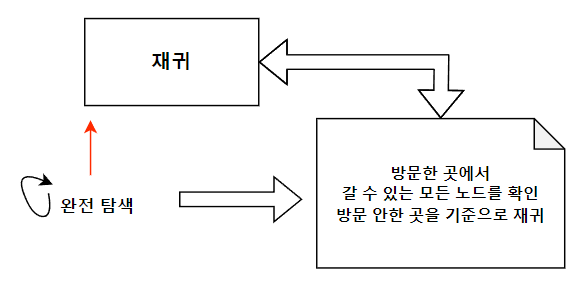

# DFS

## 개요

 트리를 완전 탐색하는 방법이다. 너비 우선으로, 재귀를 이용하여 깊이 우선으로 탐색한다.
 여기서 깊게 탐색하는 것은=> 자신의 자식을 우선해서 탐색하기 때문이다.
 
## 방법

1. node에서 방문할 수 있는 다음 node를 모두 graph에 기록한다.
2. 시작 노드를 기준으로 재귀 함수를 돌린다.
3. 갈 수 있는 노드면 방문 처리하고 바로 그 함수를 기준으로 방문 처리를 한다.
* 필요한 경우 방문 처리를 해제하여 다시 재탐색할 수 도 있다.

## 요약
 

## 예제 코드


```cpp
#include <iostream>
#include <vector>
#include <algorithm>
#include <queue>

using namespace std;
#define MAX 500

vector<int> graph[MAX];
int visit[MAX]; //방문할 개수이다.

void DFS(int start){
  //start 지점을 방문처리한다.
  visit[start] = true;
  for(auto i : graph[start]){
    if(!visit[i]){ // 길이 연결되어 있고 동시에, 이 i번째 노드에 방문한 적이 있는지 확인한다.
      //만약, 방문한적이 없고 길이 이어져 있다면,
      DFS(i);
    }
  }
}
int main(){
  //두가지 방식을 사용하였다(코드 테크닉)
   DFS(0);
}
```

## 활용

1. 완전 탐색을 하되, 깊이 우선 탐색이 전략적으로 필요한 경우
