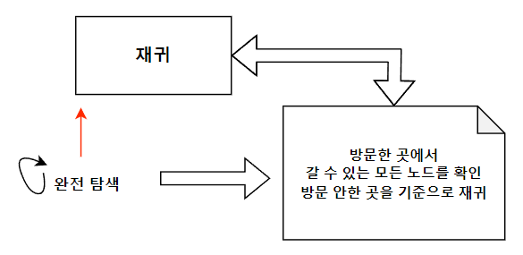

# 완전탐색

## 개요

 백트래킹은 모든 구역을 탐색하는 중간에, 조건에 맞지 않으면 중단하고 다른 구역을 탐색하여 효율적으로 탐색한다.

 모든 경우의 수를 고려해야하는 문제라면, DFS로 구현하는게 편리하며, 일반적으로 DFS를 통해 설계해나간다.
 다만, 트리의 깊이가 무한하게 되는 경우, 즉 미로 찾기 같은 경우에서 루프가 발생하는 경우에는 BFS가 편리하다.

 간단히, 해가 될 가능성이 있으면 찾아가고, 해가 될 가능성이 없으면 가지치기한다.

 
## 방법

1. DFS, BFS를 통해 노드를 탐색한다.
2. 이 탐색에 더 이상 가치가 없는 경우 도중에 중단한다.
3. 결과 노드를 찾는다.

## 요약(DFS 이미지 가져옴)
 

## 예제 코드


```cpp
#include <iostream>
#include <vector>
#include <algorithm>
#include <queue>

using namespace std;
#define MAX 500

vector<int> graph[MAX];
int visit[MAX]; //방문할 개수이다.

void DFS(int start){
  //start 지점을 방문처리한다.
  visit[start] = true;
  for(auto i : graph[start]){
    if(!visit[i]){ // 길이 연결되어 있고 동시에, 이 i번째 노드에 방문한 적이 있는지 확인한다.
      //만약, 방문한적이 없고 길이 이어져 있다면,
      DFS(i);
    }
  }
}
int main(){
  //두가지 방식을 사용하였다(코드 테크닉)
   DFS(0);
}
```

## 활용

1. 완전 탐색을 하되, 깊이 우선 탐색이 전략적으로 필요한 경우
